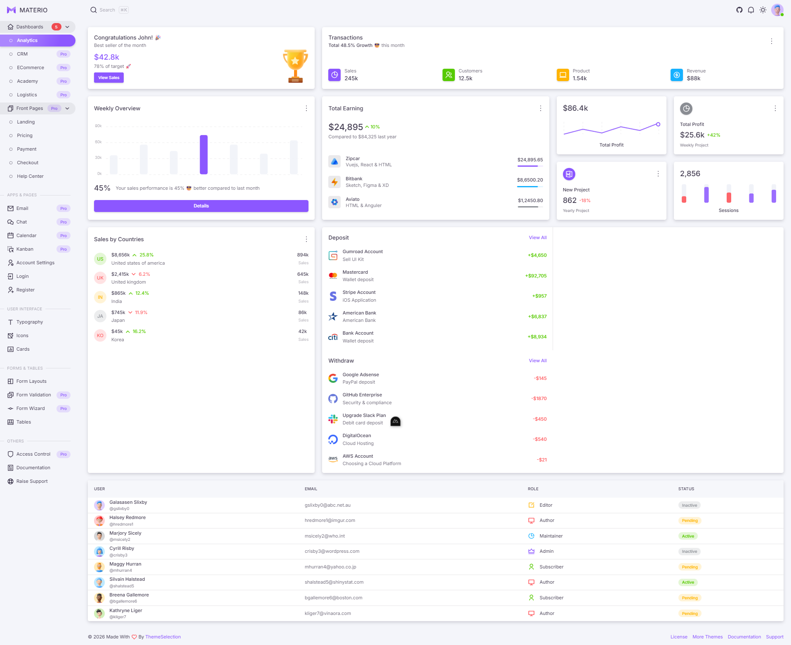

## challenge

### choice 1: implement dashboard page using the project's components



stretch goal: style a component using yourniis colors and fonts

### choice 2: 
integrate https://jsonplaceholder.typicode.com/users for the user assuming user_id = 1
/account-settings
encapsulate the backend in a suitable class and write unit tests

stretch goal: style a component using yourniis colors and fonts


### choice 3:
style /cards according to the yournii style guidelines and materials
Huisstijl_Yournii_V1.3.pdf
https://www.yournii.com/

## Project Setup

```sh
npm install
```

### Compile and Hot-Reload for Development

```sh
npm run dev
```

### Type-Check, Compile and Minify for Production

```sh
npm run build
```
